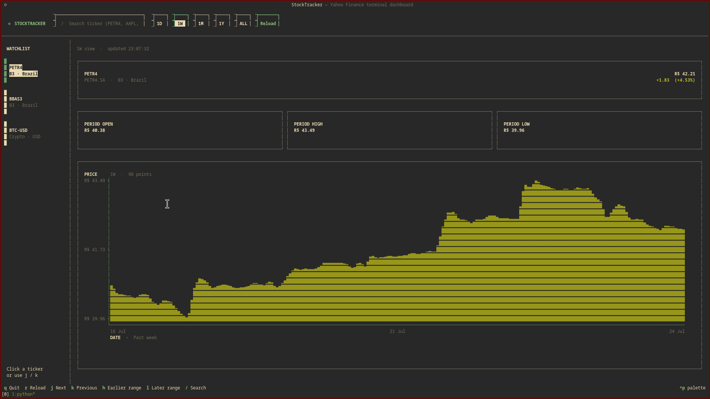
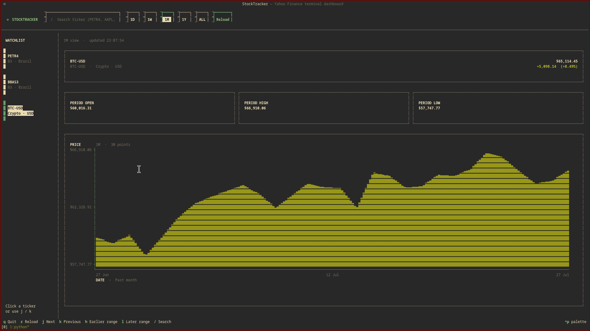

# StockTracker

StockTracker is an interactive terminal dashboard for stocks, crypto, and market
indexes using data from Yahoo Finance. It is a full TUI: use the keyboard, click
controls with the mouse, or scroll the dashboard without leaving the terminal.

## Screenshots

Fresh captures from the running dashboard are stored in [`screenshots/`](screenshots/)
as PNG files.

### PETR4 · One day



### BTC-USD · One month



## What it shows

- A clickable watchlist
- A watchlist configured outside the source code
- A persistent wallet for buy and sell entries
- Wallet summaries, weighted-average cost, realized profit/loss, and user-data plots
- Current price and period change
- Period open, high, and low
- A responsive terminal-native chart with price and date axes
- Cached views for instant navigation
- Background refreshes that do not freeze the interface
- Clear loading and data-provider error states
- Colors inherited from your terminal's active ANSI palette

## Run with Docker

[Docker](https://docs.docker.com/get-docker/) is the only host dependency.
Build the image and open the default watchlist:

```bash
git clone https://github.com/rabpaulo/Stocktracker
cd Stocktracker
docker build -t stocktracker .
docker run --rm -it \
  --user "$(id -u):$(id -g)" \
  --env HOME=/tmp \
  --volume "$PWD/stocktracker.json:/app/stocktracker.json" \
  stocktracker
```

The bind mount keeps watchlist and wallet changes in
[`stocktracker.json`](stocktracker.json) after the container exits. Running the
image without this mount stores changes only in that one container. Edit the
`tickers` list to add or remove symbols without changing `main.py`:

```json
{
  "tickers": [
    "PETR4.SA",
    "BBAS3.SA",
    "BTC-USD",
    "AAPL"
  ],
  "wallet_entries": []
}
```

The dashboard keeps the search and add actions separate:

- **Search** (or `Enter`) opens a ticker without changing the watchlist.
- **Add** appends the ticker to this file and keeps it in the watchlist after a
  restart.

## Wallet

Select the **Wallet** tab (or press `2`) to log a transaction. Each entry has a
ticker, a **Buy** or **Sell** type, quantity, and execution price. Entries are
saved to the `wallet_entries` list in the same configuration file, so they remain
available after a local or Compose restart.

The Wallet tab starts in navigation mode. Press `j` / `k` to move through the
entry log, `g` / `G` to jump to its first / last row, and `i` to edit a new
entry. `Enter` advances through the form; `Esc` returns to the log without
discarding the current form values.

The wallet calculates open positions using weighted-average cost, prevents sales
larger than the recorded position, and shows:

- Open cost, cumulative net invested, and realized profit/loss
- An open-cost-by-asset bar plot
- A cumulative net-invested plot based on the entry timeline
- A newest-first transaction log

Wallet values use the prices exactly as entered and do not perform currency
conversion. Keep entries in a common currency when comparing portfolio totals.

Pass tickers and periods after the image name:

```bash
docker run --rm -it stocktracker AAPL MSFT BTC-USD
docker run --rm -it stocktracker PETR4 BBAS3 -t 1m
```

Positional tickers override the configured watchlist only for that run. To use a
different configuration file, pass `--config`:

```bash
python3 main.py --config ~/my-stocktracker.json
```

The included Compose configuration provides the same workflow:

```bash
docker compose build
docker compose run --rm stocktracker
docker compose run --rm stocktracker AAPL MSFT BTC-USD
```

Compose mounts `stocktracker.json` into the container, so edits on the host,
tickers added through search, and wallet entries remain available after the
container exits. If your host user does not use UID/GID `1000`, provide the IDs
when starting Compose:

```bash
STOCKTRACKER_UID="$(id -u)" STOCKTRACKER_GID="$(id -g)" \
  docker compose run --rm stocktracker
```

For the equivalent persistent setup with `docker run`:

```bash
docker run --rm -it \
  --user "$(id -u):$(id -g)" \
  --env HOME=/tmp \
  --volume "$PWD/stocktracker.json:/app/stocktracker.json" \
  stocktracker
```

Brazilian stock symbols such as `PETR4` and `BOVA11` automatically receive the
`.SA` suffix. Yahoo symbols that already contain a suffix or separator, such as
`BTC-USD`, `^BVSP`, and `VALE3.SA`, are preserved.

## Run locally

To run without Docker, install Python 3.10 or newer and create a virtual
environment:

```bash
python3 -m venv .venv
source .venv/bin/activate
python3 -m pip install -r requirements.txt
python3 main.py
```

CLI arguments work the same way:

```bash
python3 main.py AAPL MSFT BTC-USD
python3 main.py PETR4 BBAS3 -t 1m
```

## Controls

| Input | Action |
| --- | --- |
| Mouse click | Select a ticker, period, search field, or reload button |
| Mouse wheel | Scroll the dashboard or watchlist |
| `1` / `2` | Open the Market / Wallet tab |
| `j` / `k` | Select the next / previous ticker |
| `l` / `h` | Select the next / previous period |
| `i` | Edit a new Wallet entry |
| `j` / `k` (Wallet) | Select the next / previous entry |
| `g` / `G` (Wallet) | Jump to the first / last entry |
| `/` | Focus ticker search |
| `Enter` / **Search** | Open the entered ticker without changing the watchlist |
| `a` / **Add** | Save the searched ticker to the configuration and watchlist |
| `r` | Reload the selected ticker and period |
| `Esc` | Leave editing and return to the current list |
| `q` | Quit |

The footer is also clickable in terminals with mouse reporting enabled.

## Periods

| Key | Range | Yahoo Finance interval |
| --- | --- | --- |
| `1d` | One trading day | One minute |
| `1w` | Seven days | Thirty minutes |
| `1m` | One month | One day |
| `1y` | One year | One week |
| `all` | All available history | One month |

In StockTracker, `1m` means one month.

## Notes

Quotes are supplied by Yahoo Finance through `yfinance` and may be delayed.
Previously loaded ticker/period combinations are cached for fast switching.
Press `r` or click **Reload** to request fresh data.

The interface uses your terminal's default foreground and background plus its
configured ANSI accent, success, and error colors. Changing your terminal color
scheme therefore changes StockTracker with it. When the `NO_COLOR` environment
variable is set, StockTracker renders in monochrome.
